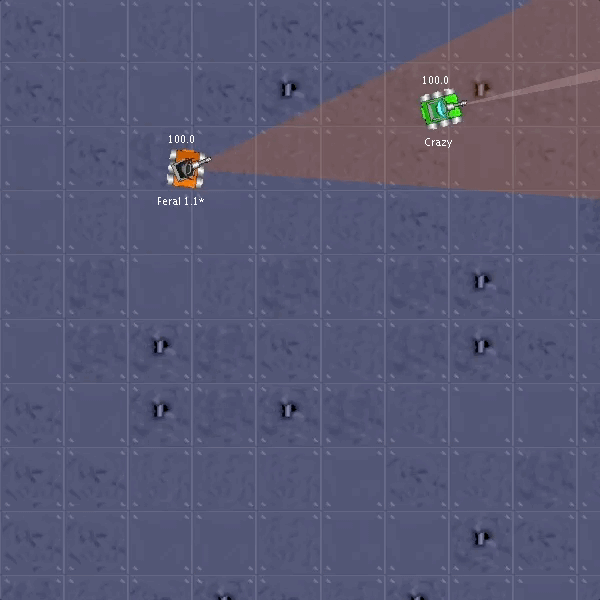

## Ben Carroll's Robocode Bot: Feral

### Overview

Feral is a bot built to participate in a class melee competition, and is built off the AdvancedRobot class. It makes use of many advanced Robocode techniques, including predictive targeting, strafing movement and a locking radar.

### Targeting

Feral uses a predictive targeting algorithm to shoot at enemies predicted positions. To find and gather data about enemies, it locks its radar onto the closest bot to get data as fast as possible. Every 50 turns, it turns the radar 360 degrees to re-calculate the closest bot.

### Movement

Feral uses a strafing movement strategy and keeps itself perpendicular to its angle to the enemy. This helps us vary our position to throw off enemy targeting. It chooses a random distance between 25% above and below 185px to move after each turn. Its movement is based entirely off the robot it is currently tracking.

### Cool Features

To store data, Feral uses a map of custom classes which store a lot of data on each bot, including distance, velocity, bearing, coordinates, predicted coordinates and the last time it was scanned.

Feral will automatically disable its rescan feature if there is only one bot left in the arena, to ensure it never misses anything the enemy does.

### See it in action

#### Feral vs. Tracker

#### Feral vs. Crazy

#### Feral vs. VelociRobot

### Win Rates

300 rounds were run against each bot, and the win rate was averaged over these simulations.

| Robot Name | Win Rate |
|-:|:-|-|
| MyFirstRobot | 100% |
| Crazy | 100% |
| RamFire | 98% |
| VelociRobot | 100% |
| TrackFire | 96% |
| SpinBot | 100% |
| Walls | 100% |
| Neff (30/10) | 99% |
| JamesBot (01/11) | 99% |
| Gordon (30/10) | 100% |
